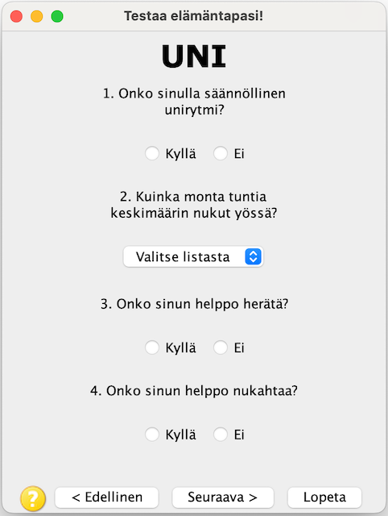
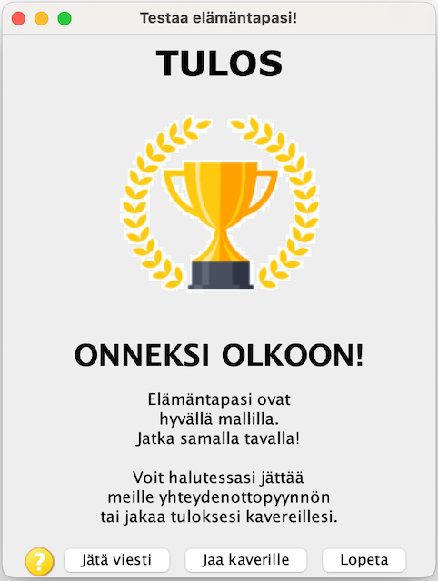

# HealthQuiz

HealthQuiz is the student project for the Programming 4 course in the Bachelor's studies in Computer Science at the University of Oulu, during in the spring of 2024. The Programming 4 course focuses on object-oriented programming and user interface design. HealthQuiz is an  mock-up/advertisement game that deals with questions about sleep, nutrition, and exercise. The user receives feedback based on user own answers. User can leave a message for the service provider and share the result on various social media channels. HealthQuiz is implemented using Java Swing technology. There is no real functionality for sending messages or sharing on social media. HealthQuiz is currently only in Finnish language.


## Screenshot

<p align="center" width="100%">
    
    
    
</p>

## Requirements

- JRE (Java Runtime Environment) to run the game.
- Maven. If you want to compile or create package.


## Compile

Use Maven to create package. Be sure you are in the same folder as the pom.xml

```bash
mvn package
```

## Usage

Java Runtime .jar will be created to target folder. In your CLI:

```bash
cd target
java -jar healthquiz-1.0-SNAPSHOT.jar
```

or you can to run directly from the Main class which is src/main/java/com/healthquiz/HealthQuizApp.java in your IDE

## How to play

The game starts by selecting **'ALOITA >>>'**. The game provides instructions on guide page. After this, you will receive various questions about your health care to be answered. Navigate through the game by selecting forwards as **'Seuraava >'** or previous as **'< Edellinen'**. Finally, you will receive feedback based on your answers. After that you can choose to leave message to service provider, share result to various social media platform or just quit the game. 

You can quit the game at any time and any page by selecting **'Lopeta'** or just by closing the main window. Instructions are available during the game via the question mark  icon.

If you wish to play the game again, restart the game by running it from the command line or from your OS GUI. 

## Contributing

Pull requests are welcome. For bugs and feature requests, please do not hesitate to [make an issue](https://github.com/Maantol/healthquiz/issues)

## License

Copyright © 2024 [Heli Mikkonen](mailto:heli.mikkonen@student.oulu.fi), [Matti Tolonen](mailto:matti.tolonen@student.oulu.fi).
